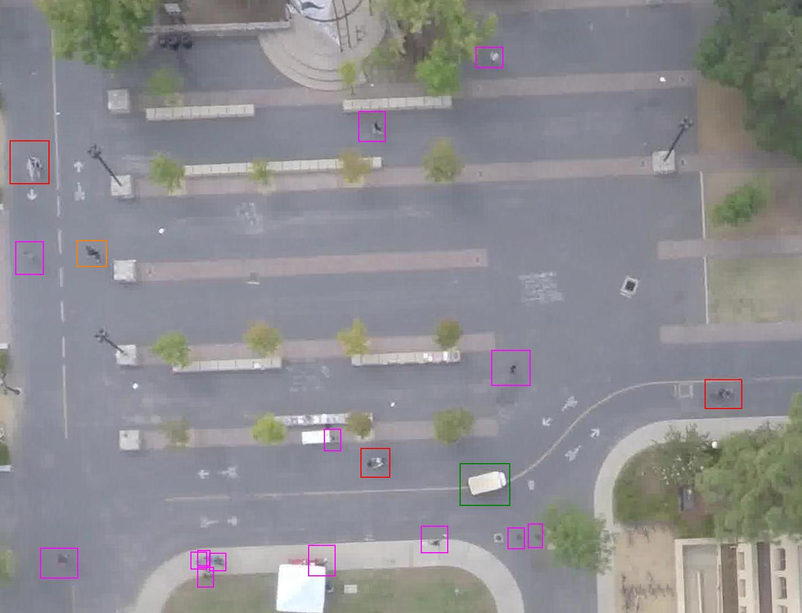
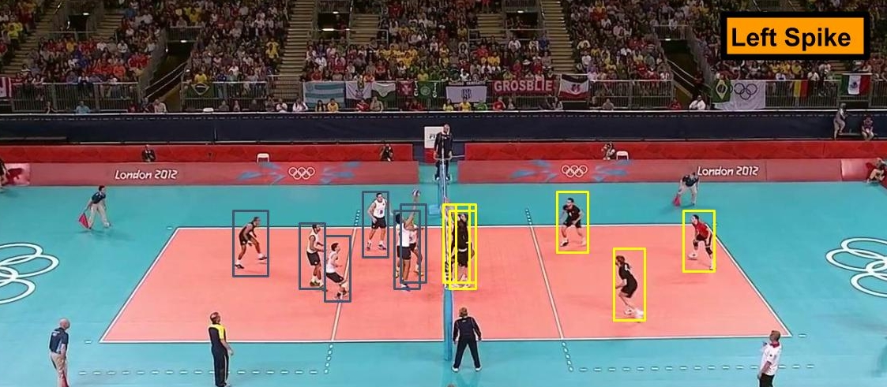
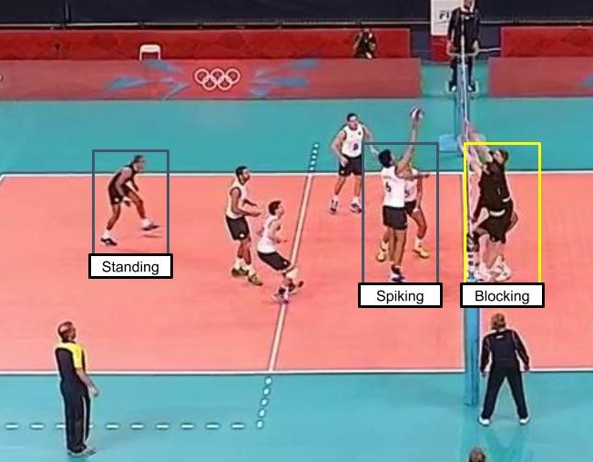

# Action-Recognition

  - [Introduction](#introduction)
  - [Baseline 1 - Social LSTM](#baseline-1---social-lstm)
  - [Baseline 2 - Social Attention](#baseline-2---social-attention)
  - [Baseline 3 - Social Attention Based on Hierarchical Deep Temporal Models](#baseline-3---social-attention-based-on-hierarchical-deep-temporal-models)
  - [Baseline 4 - Social Scene Understanding (SSU)](#baseline-4---social-scene-understanding-ssu)
  - [Baseline 5 - Spatial-Temporal Graph Convolutional Networks Based on SSU](#baseline-5---spatial-temporal-graph-convolutional-networks-based-on-ssu)
  - [Datasets](#datasets)
    - [Stanford Drone Dataset](#stanford-drone-dataset)
    - [Volleyball Dataset](#volleyball-dataset)

## Introduction

The project aims to utilize deep neural networks to recognize individual actions and group activities in volleyball games.

The project is a joint research project between Tianjin University and SUNY, Albany.

I implemented multiple baselines, and five of them are released in this repo. As we are still working on the newest version, its code is not available now.

The task of **Baseline 1 & 2 (Social-Pooling)** was to predict trajectories of objects in Stanford dataset. The goal of the two baselines was to explore whether attention mechanism can work.

Then we moved on to the [Volleyball Dataset](https://github.com/mostafa-saad/deep-activity-rec "Volleyball Dataset") and utilized **Baseline 3 (Atten-Based-Hierarchical-Deep-Temporal-Model)** to get players' RGB features and added attention mechanism.

However, **Baseline 3** led to serious overfitting. After trying multiple techniques, the problem still remained. Hence, we utilized the backbone architecture of **Baseline 4 (Social-Scene-Understanding)**.

Also, we added graph convolutional networks on **Baseline 4**, i.e. **Baseline 5 (Graph-Convolutional-Networks)** and achieved the best result at that time.

## Baseline 1 - Social LSTM

I firstly implemented *Alahi et al., Social LSTM: Human Trajectory Prediction in Crowded Spaces, CVPR 2016* on [Stanford Drone Dataset](http://cvgl.stanford.edu/projects/uav_data/ "Stanford Drone Dataset")
using PyTorch. The baseline aims to predict pedestrian's track with the help of Social Pooling Algorithm and LSTM (we replaced it with GRU)

A brief description of [Stanford Drone Dataset](http://cvgl.stanford.edu/projects/uav_data/ "Stanford Drone Dataset") can be found in the last section.

For further explanation, please visit this [readme file](Social-Pooling/README.md "Social LSTM").

## Baseline 2 - Social Attention

Then I added the attention mechanism described by *Vemula et al., Social Attention: Modeling Attention in Human Crowds, ICRA 2018* to help the model focus on all other objects in the frame when predicting the current object’s track.

For further explanation, please visit this [readme file](Social-Pooling/README.md "Social LSTM").

## Baseline 3 - Social Attention Based on Hierarchical Deep Temporal Models

Next, we moved on to the [Volleyball Dataset](https://github.com/mostafa-saad/deep-activity-rec "Volleyball Dataset") and utilized *Ibrahim et al., A Hierarchical Deep Temporal Model for Group Activity Recognition, CVPR 2016* as a backbone architecture. As the source code is in CAFFE, I implemented the work in PyTorch so that we could try our own ideas on it.

A brief description of [Volleyball Dataset](https://github.com/mostafa-saad/deep-activity-rec "Volleyball Dataset") can be found in the last section.

For further explanation, please visit this [readme file](Atten-Based-Hierarchical-Deep-Temporal-Model/README.md "Atten HDT").

## Baseline 4 - Social Scene Understanding (SSU)

Unluckily, the overfitting cannot be handled easily. Hence, we turned to another backbone architecture described in *Bagautdinov et al, Social Scene Understanding: End-to-End Multi-Person Action Localization and Collective Activity Recognition, CVPR 2017*. As the source code is in TensorFlow, I implemented the work in PyTorch so that we could try our own ideas on it.

For further explanation, please visit this [readme file](Social-Scene-Understanding/README.md "Social-Scene-Understanding").

## Baseline 5 - Spatial-Temporal Graph Convolutional Networks Based on SSU

After implementing the above baselines and adding attention mechanism, the test accuracy remained to be below the state of the art. Hence, we replaced the attention mechanism with *Yan et al., Spatial-Temporal Graph Convolutional Network, AAAI 2019* and got the best result at that time.

For further explanation, please visit this [readme file](Graph-Convolutional-Networks/README.md "Graph-Convolutional-Networks").

## Datasets

The project used the following two datasets up to now. The first is [Stanford Drone Dataset](http://cvgl.stanford.edu/projects/uav_data/ "Stanford Drone Dataset") and the second is [Volleyball Dataset](https://github.com/mostafa-saad/deep-activity-rec "Volleyball Dataset"). Baseline 1 & 2 used the first and the following work utilized the second.

### [Stanford Drone Dataset](http://cvgl.stanford.edu/projects/uav_data/ "Stanford Drone Dataset")

The [Stanford Drone Dataset](http://cvgl.stanford.edu/projects/uav_data/ "Stanford Drone Dataset") includes four types of objects, and all of the objects shown in picture were annotated with their bounding boxes.

In the following picture, pedestrians are labeled in pink, bicyclists in red, skateboarders in orange, and cars in green.

### [Volleyball Dataset](https://github.com/mostafa-saad/deep-activity-rec "Volleyball Dataset")

The dataset is proposed by *Ibrahim et al., A Hierarchical Deep Temporal Model for Group Activity Recognition, CVPR 2016*.

They annotated 4830 frames that were handpicked from 55 YouTube videos with 9 player action labels and 8 team activity labels.

Examples of the dataset are shown above. For more information, please visit [this repo](https://github.com/mostafa-saad/deep-activity-rec "Deep-Activity-Rec").

A frame labeled as Left Spike and bounding boxes around each team players is annotated in the dataset.

For each visible player, an action label is annotated.
