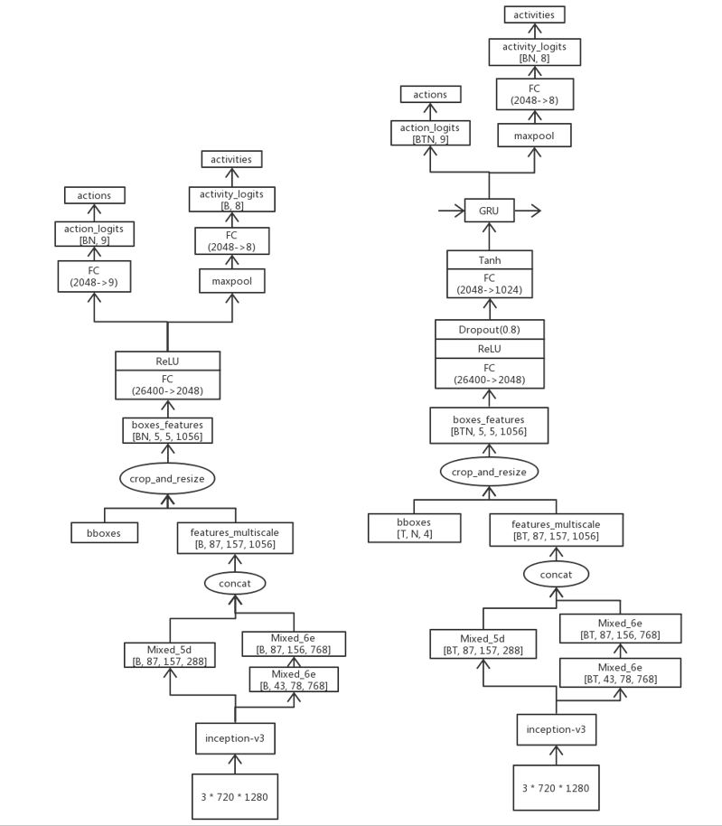

# Baseline 4 - Social Scene Understanding

Unluckily, the overfitting in **Baseline 3** cannot be handled easily. We tried to adopt $L2$ normalization and different CNN as backbones. But the overfitting problem still occurred. Hence, we turned to another backbone architecture described in *Bagautdinov et al., Social Scene Understanding: End-to-End Multi-Person Action Localization and Collective Activity Recognition, CVPR 2017*. As the source code is in TensorFlow, I implemented the work in PyTorch so that we could try our own ideas on it.

## Files Illustration

- [io_common.py](io_common.py "io_common.py") & [tsv_io.py](tsv_io.py "tsv_io.py") provide the tools to read TSV files. The two files are written by Microsoft Research.
- [model.py](model.py "model.py") provides the network implementation.
- [train_a.py](train_a.py "train_a.py") provides the main function to train network in the first phase.
- [train_b.py](train_b.py "train_b.py") provides the main function to train network in the second phase.
- [volleyball_loader_a.py](volleyball_loader_a.py "volleyball_loader_a.py") is used to read images from TSV files.
- [volleyball_loader_b.py](volleyball_loader_b.py "volleyball_loader_b.py") is used to read extracted features from TSV files.

## Methods

The main differences from **Baseline 3** are concluded as:

- Replace the previous CNN with Fully Convolutional Networks (FCN).
- Input the whole HD images and use the rescale bounding boxes to crop the FCN output.

The network architecture is shown as below.

## Results

The result statics is shown as below:

| Action Rec. Acc. | Bagautdinov et al.(2017) | PyTorch implementation |
| ---------- | :-----------:  | :-----------: |
| Person | 82.4% | 89.9% |
| Group | 81.15% | 90.43% |
